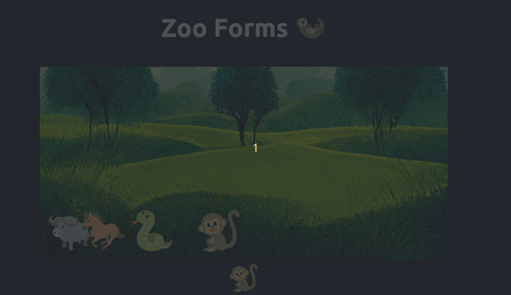

# Zoo Forms

A small take-home assignemnt I did a while ago - I think it turned out quite cute.



This project was bootstrapped with Good ol' [Create React
App](https://github.com/facebook/create-react-app) since that was a requirement.

The name is a pun on 'two forms' - since the original request was for a simple
app that had two forms.

## Installing:

```bash
$ npm ci # preferred
$ npm install # should always work
```

Note that the software was built with the following node/npm combo.

```bash
$ npm -v
8.3.1
$ node -v
v16.14.0
```

If you face installation problems, use `nvm` and switch to this version.

## FOSS

> Usage of well-known library such as redux, react-router.

I decided to go for a very light stack. I originally wanted to go for redux +
FluentUI, but given that it was just two forms it didn't make much sense.

I used the following extra libraries:

* `"@react-spring/web": "^9.5.2",`

For the cute animations! See also the vendored useBoop.

`"react-hook-form": "^7.34.2",`

Tremendous library for handling forms. Have used, and loved, it before.

`"react-router-dom": "^6.3.0",`

We needed two views so it was rather obvious.

`"styled-components": "^5.3.5",`

The great `CSS-in-JS` library.

`"usehooks-ts": "^2.6.0",`

Didn't want to bother to implement a correct `useOnClickOutside`.

